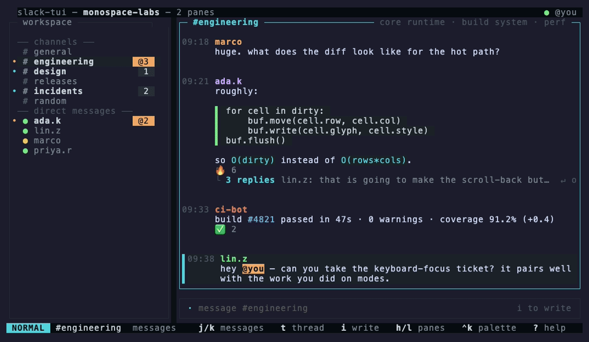
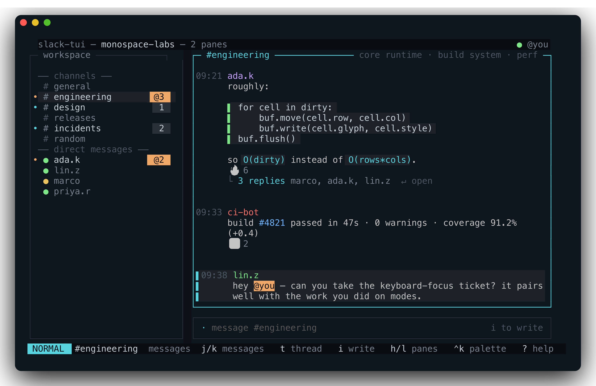
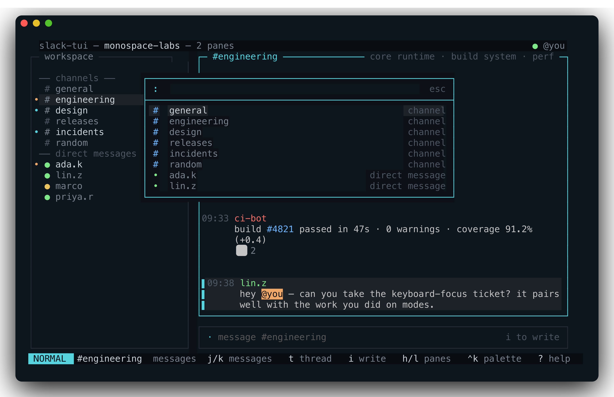
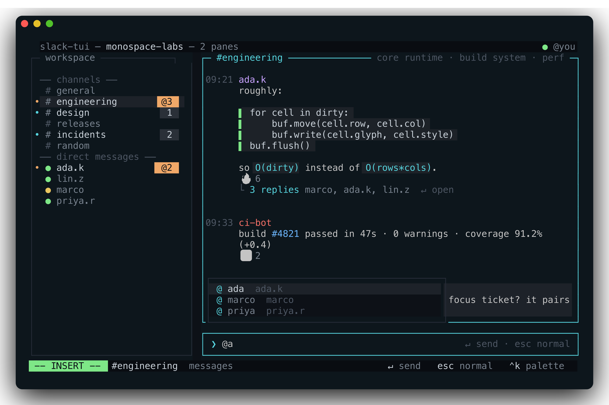
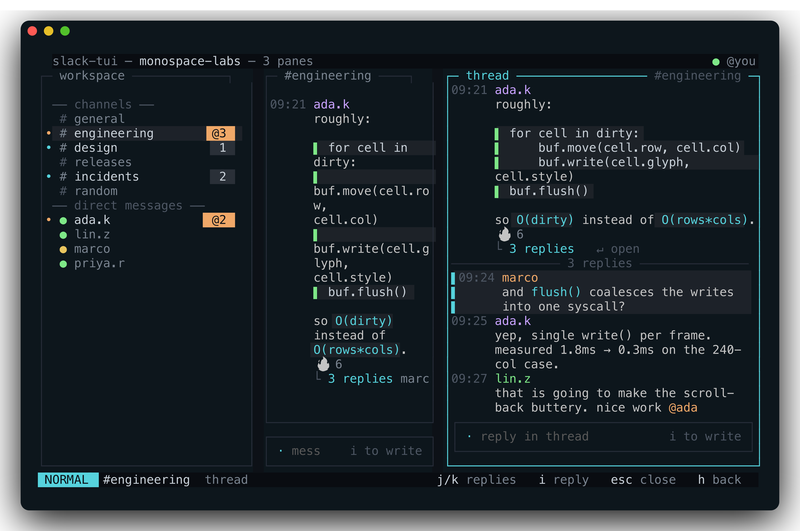

<div align="center">

# slack-tui

**A keyboard-first, vim-modal Slack client for your terminal.**

Like `vim` or `lazygit` — not another Electron window.
Built with [Bubble Tea](https://github.com/charmbracelet/bubbletea).

[](https://github.com/kurenn/slack-tui/actions/workflows/ci.yml)
[](https://github.com/kurenn/slack-tui/releases)
[](LICENSE)



</div>

## Features

- **Vim-modal** — NORMAL/INSERT modes, `j/k`, `gg/G`, `Ctrl-d/u`, `/` find, `dd` delete
- **Everything async** — sends are optimistic, channels load in the background, the UI never freezes
- **Threads, reactions, edits** — open threads, react with any emoji, edit and delete your messages
- **Autocomplete** — `@` pops handles (mentions actually ping), `:` pops emoji
- **Fuzzy everything** — command palette (`Ctrl-K`), workspace search (`s`), channel browser & join
- **Lives in the background** — Socket Mode live unread (self-healing), terminal bell on mentions, unread count in the terminal title, `── new ──` divider at first unread
- **Follows your desktop theme** on [Omarchy](https://omarchy.org) — re-theme and the TUI repaints with it; 5 built-in themes × 7 accents everywhere else
- **Mock workspace built in** — run it with zero setup to try the feel

<div align="center">
 
 
</div>

## Install

**Homebrew** (macOS):

```sh
brew install kurenn/tap/slack-tui
```

**Install script** (macOS/Linux — verifies checksums, no Go needed):

```sh
curl -fsSL https://raw.githubusercontent.com/kurenn/slack-tui/main/install.sh | sh
```

**Go:**

```sh
go install github.com/kurenn/slack-tui@latest
```

> `go install` puts the binary in `$(go env GOPATH)/bin` (usually `~/go/bin`) —
> make sure that's on your `PATH`, then check with `slack-tui --version`.

…or grab a binary from the [releases page](https://github.com/kurenn/slack-tui/releases).

```sh
slack-tui          # no token? you get a mock workspace to play with
```

## Connect to Slack

```sh
slack-tui setup
```

That's it. It copies the app manifest to your clipboard, opens
api.slack.com/apps, waits while you paste it into your workspace, asks for the
Client ID it gives you, and signs you in. Two minutes, once.

Running `slack-tui` first works too — onboarding walks you through the same
three steps without leaving the TUI.

<details>
<summary>Why you create an app at all</summary>

slack-tui isn't distributed through Slack, and an undistributed Slack app can
only be installed in the workspace that owns it. So there's no shared app to
sign you in — each workspace needs its own. The upside is that the app is
yours: it's not a third party you're trusting, and your messages never pass
through anyone else's infrastructure.

There's **no client secret** anywhere in this. Sign-in uses
[PKCE](https://docs.slack.dev/authentication/using-pkce/), where the exchange is
proved with a one-time verifier generated on your machine, so the only thing
stored is a public client ID. Slack in fact *requires* PKCE here — a loopback
redirect is a "non-web URI" and it refuses the sign-in without it.

The browser redirect lands on `http://localhost:9899/callback` (or the next free
port up to `9903`), so the token never leaves your machine. Tokens live in
`~/.config/slack-tui/tokens.json` (0600); `SLACK_USER_TOKEN`, `SLACK_APP_TOKEN`
and `SLACK_BOT_TOKEN` override per-token.

</details>

<details>
<summary>Tokens expire after ~12 hours — slack-tui refreshes them</summary>

Slack forces token rotation for a loopback redirect, regardless of the app's
token-rotation setting, so there's no opting out. slack-tui renews the token
within 30 minutes of expiry, at launch and again on its poll loop, so a session
left running overnight keeps working. The refresh token is single-use and its
replacement is written to disk before being used, so an interrupted refresh
costs nothing worse than one `slack-tui login`. `slack-tui doctor` shows the
time remaining. A hand-pasted `xoxp-…` token doesn't expire and is never
refreshed.

</details>

> **Using an agent?** Point Claude Code (or similar) at
> [`docs/agent-setup.md`](docs/agent-setup.md) and it will do the parts that can
> be automated, stopping at the two clicks that need you.

> Some workspaces require an admin to approve third-party apps. If sign-in comes
> back denied, that's the wall you hit — ask your admin to approve it.

### Socket Mode (live unread)

Sign-in gets you a **user token**, and that runs everything except the live
unread stream, which falls back to polling without one.

Slack will not issue a bot token to this flow, from any app: a loopback redirect
is a "non-web URI", and *"Bot scopes are not allowed when redirecting to a
non-web URI."* So the two Socket Mode tokens are both copied by hand from your
own app's admin page — the `xapp-…` app-level token and the `xoxb-…` bot token —
and pasted into onboarding or set as `SLACK_APP_TOKEN` / `SLACK_BOT_TOKEN`.

That's the only reason to create your own app. If you don't need live unread,
you never need one.

Prefer to do it by hand, or want to see what `setup` does?

1. Create a Slack app from the manifest below
   (api.slack.com/apps → *Create New App* → *From a manifest* → paste it).
   It's also in the repo as [JSON](slack-app-manifest.json) and
   [YAML](slack-app-manifest.yaml).

<details>
<summary><b>App manifest (JSON)</b> — click to expand & copy</summary>

```json
{
  "display_information": {
    "name": "slack-tui",
    "description": "A keyboard-first terminal Slack client",
    "background_color": "#0d1117"
  },
  "features": {
    "bot_user": {
      "display_name": "slack-tui",
      "always_online": false
    }
  },
  "oauth_config": {
    "redirect_urls": [
      "http://localhost:9899/callback",
      "http://localhost:9900/callback",
      "http://localhost:9901/callback",
      "http://localhost:9902/callback",
      "http://localhost:9903/callback"
    ],
    "scopes": {
      "user": [
        "channels:history",
        "channels:read",
        "channels:write",
        "groups:history",
        "groups:read",
        "groups:write",
        "im:history",
        "im:read",
        "im:write",
        "mpim:history",
        "mpim:read",
        "mpim:write",
        "users:read",
        "chat:write",
        "files:read",
        "files:write",
        "reactions:read",
        "reactions:write",
        "users:write",
        "dnd:write",
        "users.profile:write",
        "search:read"
      ],
      "bot": [
        "channels:history",
        "channels:read",
        "groups:history",
        "im:history",
        "mpim:history",
        "users:read"
      ]
    }
  },
  "settings": {
    "event_subscriptions": {
      "bot_events": [
        "message.channels",
        "message.groups",
        "message.im",
        "message.mpim"
      ]
    },
    "interactivity": {
      "is_enabled": false
    },
    "org_deploy_enabled": false,
    "socket_mode_enabled": true,
    "token_rotation_enabled": false
  }
}
```

</details>

2. *OAuth & Permissions* → *Install to Workspace*, then copy the **Bot User
   OAuth Token** (`xoxb-…`). *Basic Information* → *App-Level Tokens* →
   generate one with `connections:write` for the `xapp-…` token.

3. To sign in against your own app rather than the built-in one, set
   `SLACK_CLIENT_ID` (from *Basic Information* → *App Credentials*), or put it
   in `~/.config/slack-tui/oauth.json`:

```sh
SLACK_CLIENT_ID=… slack-tui login
```

There is no client **secret** in any of this. Slack requires PKCE for loopback
redirects, and a PKCE client must not send a secret — if you have one left in
`oauth.json` from an older version, it is ignored and can be deleted.

Run `slack-tui doctor` to diagnose your setup — it reports which tokens are
in use (and warns when a stale env var overrides `tokens.json`), checks
`auth.test`, flags any missing OAuth scopes, and probes Socket Mode. Tokens
are masked in the output.

Both Socket Mode tokens must be present, and the bot has to be invited to the
channels you care about (`/invite @slack-tui`) — without that, unread badges
refresh on a slow poll instead.

**Multiple workspaces:** run `slack-tui login` once per workspace — each
sign-in is saved under its team name. Switch in-app via `Ctrl-K` →
*Switch workspace* (one workspace live at a time, tmux-session style), or
launch directly into one with `slack-tui --workspace <name>`.

> **Talking to bots?** Slack tags every API-posted message with the sending
> app's `bot_id` (yours will carry slack-tui's). Bots with the classic
> anti-loop filter — `if bot_id: ignore` — silently ignore everything sent
> from slack-tui. If you control the bot, filter on *its own* `bot_id` (or
> `subtype == "bot_message"` / missing `user`) instead: a message with both
> `user` and `bot_id` is a human talking through an API client.

## Theming

On [Omarchy](https://omarchy.org), slack-tui reads the active desktop palette
from `~/.local/state/omarchy/current/theme/colors.toml` and repaints when you
run `omarchy theme set …` — no restart, and light themes work as well as dark.
A fresh install picks this up automatically and onboarding skips the colour
questions, since the desktop already answers them.

To pin a fixed palette instead, choose one of the 5 built-in themes in settings
(`,`) — that overrides the desktop and is what gets saved. Everywhere other than
Omarchy, the built-in themes are the only option and nothing changes.

## Keys

| | |
|---|---|
| `j/k` `gg/G` `Ctrl-d/u` | move · jump · half-page (arrows work too) |
| `Tab` `h/l` `←/→` | switch panes |
| `Enter` / `t` | open thread |
| `i` · `r` | write · reply in thread |
| `Alt-Enter` | newline in the composer |
| `@…` `:…` | autocomplete mentions / emoji (`Tab` accepts) |
| `a` · `e` · `dd` · `y` | react · edit · delete · yank |
| `o` | open message links/files |
| `/` `n/N` · `s` | find in channel · search workspace |
| `T` | threads inbox (threads you're in) |
| `]` `[` | next/prev unread |
| `Ctrl-K` | command palette (fuzzy) |
| `,` · `?` | settings · help |
| `Esc` · `q` | close/dismiss · quit |

The mouse wheel scrolls. `?` shows the full keymap in-app.

## Development

```sh
go run .                          # mock workspace, no setup
go run . --dump 100x30            # render one frame to stdout (headless)
go run . --dump 100x30 "ctrl+k"   # …after replaying keys
go test ./...                     # hermetic — never touches the network
```

The architecture in one breath: `internal/source` abstracts the backend (a
mock and a real Slack client behind one interface — network calls run inside
`tea.Cmd`s, never on the UI thread), `internal/app` is the Bubble Tea model
with the modal keyboard engine, and `internal/ui` renders the panes.

## License

[MIT](LICENSE)
